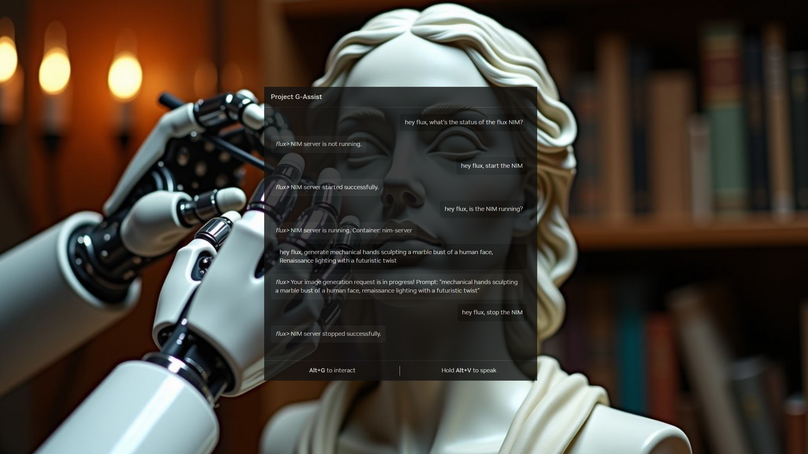

# Flux Plug-in for Project G-Assist


The Flux Plugin for G-Assist is a plugin developed for NVIDIA's Project G-Assist that brings real-time AI image generation directly to the desktop through natural language commands. It allows users to create high-quality images using the Flux family of models from Black Forest Labs, seamlessly integrated with the G-Assist interface. Users can simply type or speak prompts such as "a futuristic robot painter in a neon-lit workshop", and the plugin handles the entire process—from submitting the prompt to generating and displaying the image—all without leaving the G-Assist chat window.

The plugin supports multiple inference backends, including Flux NIMs running locally via WSL, cloud-hosted NIMs on build.nvidia.com, InvokeAI and ComfyUI. This plugin supports both text to image generation and image-to-image generation using screenshots from the NVIDIA Gallery. The plugin includes additional tools for managing the inference services, such as checking status and turning the NIM service on or off, enabling a user-friendly experience for both beginners and power users.

The goal of this plugin is to make generative image workflows faster, more accessible, and more fun—leveraging the strengths of NVIDIA’s hardware, AI models, and desktop ecosystem. By combining the power of FLUX with the voice-enabled G-Assist chat interface, the plugin turns your RTX AI PC into a creative studio.

## What Can It Do?

### Image Generation
- **Generate images from text prompts** using the Flux.1-dev image model from Black Forst Labs
- **Support for multiple backends**: Local NIM servers, NVIDIA hosted inference services, InvokeAI or ComfyUI
- **Automatic desktop background setting** - generated images can be set as your wallpaper
- **High-quality output** with customizable parameters (aspect ratio, steps, CFG scale)

### NIM Server Management
- **Start/stop local Flux NIM servers**: G-Assist commands communicate with NIM servers using WSL and Podman
- **Check NIM server status** to see if the service is running
- **Health endpoint testing** to check if your NIMs are ready to perform inference
- **Automatic configuration** using NGC API keys and Hugging Face tokens from plugin configuration

### Flux Kontext NIM Integration
- **Direct API access** to Flux Kontext NIM servers for faster inference
- **Automatic image preparation** - screenshots are scaled and cropped to optimal dimensions
- **Seamless backend switching** - automatically chooses between NIM and InvokeAI based on configuration
- **High-performance image-to-image generation** with minimal latency

### InvokeAI and ComfyUI Integration
- **Upload screenshots to local InvokeAI or ComfyUI server** for image-to-image workflows
- **Flux Kontext generation** using uploaded images as reference
- **Automatic queueing** 
- **Processor control** - pause and resume InvokeAI processing queues
- **VRAM management** - empty model cache to free up memory
- **Status monitoring** - check InvokeAI and ComfyUI service health and version and system stats

### Smart Configuration
- **Flexible URL configuration** - works with local servers or NVIDIA hosted endpoints
- **Automatic API key validation** - ensures proper NVIDIA API key format
- **Configurable output directories** for generated images
- **Desktop wallpaper** settings optimized using fit or fill method based on image size

### Example Commands
- "hey flux, generate an image of a cyberpunk city at night"
- "/flux generate an image of a cat piloting a spaceship, aspect ratio 1:1, 40 steps"
- "/flux start the Flux dev NIM server"
- "hey flux, stop the flux kontext nim server"
- "hey flux, use kontext to make it a cartoon style" (does image-to-image generation with Flux Kontext using latest screenshot taken with NVIDIA screenshot shortcut)
- "hey flux, what is the status of comfyui?"
- "hey flux, empty the InvokeAI model cache to free up VRAM"
- "hey flux, Check if the Flux Dev NIM server is running"
- "/flux is the flux kontext nim running?"

## Before You Start
Make sure you have:
- Windows PC with Windows 11 (22H1 or later) with GeForce RTX GPU (supported hardware details: [https://docs.nvidia.com/nim/visual-genai/1.2.0/support-matrix.html#supported-hardware](https://docs.nvidia.com/nim/visual-genai/1.2.0/support-matrix.html#supported-hardware))
- Python 3.12 or higher
- NVIDIA App with Project G-Assist installed on your system

## Installation Guide Quickstart


## Full Installation Guide for Developers

### Step 1: Get the Files
Clone this repository

This downloads the plugin code and all necessary files to your computer.

### Step 2: Set Up Python Environment

Run the `setup.bat` file. This will take care of creating a Python virtual environment will install project dependencies.

```bash
python -m venv .venv
.venv\Scripts\activate
python -m pip install -r requirements.txt
```

### Step 3: Build the project

Run `build.bat` to build the project. This script will also place the `g-assist-plugin-flux.exe` and `manifest.json` files in `%PROGRAMDATA%\NVIDIA Corporation\nvtopps\rise\plugins\flux`.

### Step 4: Configuration

Copy the `config.example.json` file and rename it as `config.json` and place it in `%PROGRAMDATA%\NVIDIA Corporation\nvtopps\rise\plugins\flux`. Customize it with the appropriate configuration values (see below for configuration details). Here is an example configuration: 

```json
{
    "GALLERY_DIRECTORY": "E:\\NVIDIA",
    "FLUX_DEV_NIM_URL": "http://localhost:8000",
    "NGC_API_KEY": "xxxxxxxx",
    "HF_TOKEN": "hf_xxxxxxxx",
    "LOCAL_NIM_CACHE": "~/.cache/nim",
    "INVOKEAI_URL": "http://localhost:9090",
    "FLUX_KONTEXT_NIM_URL": "http://localhost:8011",
    "OUTPUT_DIRECTORY": "E:\\Flux"
}
```

### Step 5: Set up Flux

Follow instructions [here](https://build.nvidia.com/black-forest-labs/flux_1-dev/deploy?environment=wsl2.md) for installing the FLUX.1-dev model from Black Forest Labs using NVIDIA NIM on WSL. Be sure to do the following:

- follow instructions here: [https://docs.nvidia.com/nim/wsl2/latest/getting-started.html](https://docs.nvidia.com/nim/wsl2/latest/getting-started.html) for getting started with WSL
- use the [NVIDIA NIM WSL2 Installer](https://docs.nvidia.com/nim/wsl2/latest/getting-started.html#use-the-nvidia-nim-wsl2-installer-recommended) for configuring a new WSL environment configured with all of the required NVIDIA dependencies
- In your Hugging Face account read and accept FLUX.1-dev, FLUX.1-Canny-dev, FLUX.1-Depth-dev and FLUX.1-dev-onnx License Agreements and Acceptable Use Policy. You must accept the agreements/policies for all of the models even though this plugin does not directly use the Canny or Depth modes.
- Make sure to map port `8000` in the NIM to port `8000` on the WSL host as shown in the setup link above. 

### Step 6: Install InvokeAI (optional)

InvokeAI has a Windows installer that can be found here: [https://invoke-ai.github.io/InvokeAI/installation/quick_start/#step-2-download](https://invoke-ai.github.io/InvokeAI/installation/quick_start/#step-2-download). Download the Flux models including the **FLUX.1 Kontext dev (Quantized)** model for using Flux Kontext in the Flux Plug-in for G-Assist. By default InvokeAI runs on `http://localhost:9090`.

### Step 7: Set up Flux Kontext NIM (optional)

For faster Flux Kontext inference, you can set up a dedicated Flux Kontext NIM server. This provides direct API access without the overhead of InvokeAI. The plugin will automatically detect and use this server when `FLUX_KONTEXT_NIM_URL` is configured in your `config.json`.

**Note**: The Flux Kontext NIM is currently in development and may not be publicly available yet. When it becomes available, you'll be able to run it locally or access it through NVIDIA's hosted services.

### Step 8: Start the Flux dev NIM

Ask flux if the Flux dev NIM is running. If it is not running, ask flux to start the Flux dev NIM. This will run a command to star the Flux dev NIM container in WSL using podman: 

```python
podman_cmd = [
    'wsl', '-d', 'NVIDIA-Workbench',
    'podman', 'run', '-d', '--rm', '--name=FLUX_DEV',
    '--device', 'nvidia.com/gpu=all',
    '-e', f'NGC_API_KEY={NGC_API_KEY}',
    '-e', f'HF_TOKEN={HF_TOKEN}',
    '-p', {port}:8000',
    '-v', f'{LOCAL_NIM_CACHE}:/opt/nim/.cache/',
    'nvcr.io/nim/black-forest-labs/flux.1-dev:1.0.0'
]
```

Then ask if the NIM is ready. This will check the `/v1/health/live` and `/v1/health/ready` endpoints of the Flux dev NIM.

### Step 9: Generete AI images using the Flux Plug-in in the G-Assist chat window

Send a message to G-Assist:

"hey flux, generate a cat piloting a spaceship"

The Flux Plug-in will respond with:

flux> Your image generation request is in progress! Prompt: "a cat piloting a spaceship"

When the image generation is complete you will find the image on your Desktop background, and the image will be saved to the output directory specified in your configuration file.

### Step 10: Transform a screenshot with Flux Kontext

Take a screenshot using the NVIDIA Screenshot hotkey (usually `Alt + F1`), and then ask the Flux Plug-in to transform it to any style using Kontext.

**Note**: The plugin now uses the `FLUX_KONTEXT_INFERENCE_BACKEND` configuration to determine which backend to use for Flux Kontext generation:
- Set to `"NIM"` to use the dedicated Flux Kontext NIM server for faster inference
- Set to `"INVOKEAI"` to use InvokeAI as the backend
- Set to `"COMFYUI"` to use ComfyUI as the backend
- The plugin will validate that the chosen backend has a valid URL configuration before proceeding


hey flux, use kontext with the prompt: cartoon style


Flux does this by triggering an InvokeAI graph workflow. The generated image and the workflow can both be viewed in the InvokeAI UI:


You can ask the Flux Plug-in to pause/resume InvokeAI processing to avoid running Flux Kontext image generation while your GPU is busy with other tasks. Also you can ask flux to empty the model cache in order to free up VRAM on your GPU.

## Configuration

The Flux plugin uses a `config.json` file to manage all settings. Copy `config.example.json` to `config.json` and customize the values for your setup.

### Configuration Options

| Option | Example Values | Required |
|--------|----------------|----------|
| `GALLERY_DIRECTORY` | `"D:\\Screenshots"`, `"C:\\NVIDIA"` | No |
| `HF_TOKEN` | `"hf_your-token"` | Yes** |
| `NVIDIA_API_KEY` | `"nvapi-your-key-here"` | No* |
| `NGC_API_KEY` | `"your-ngc-key"` | Yes** |
| `FLUX_DEV_NIM_URL` | `"http://localhost:8000"`, `"http://192.168.1.100:8000"` | Yes |
| `FLUX_KONTEXT_NIM_URL` | `"http://localhost:8011"`, `"http://192.168.1.100:8011"` | No |
| `LOCAL_NIM_CACHE` | `~/.cache/nim` | Yes** |
| `OUTPUT_DIRECTORY` | `"C:\\GeneratedImages"`, `"D:\\flux-output"` | No |
| `FLUX_KONTEXT_INFERENCE_BACKEND` | `"NIM"`, `"INVOKEAI"`, `"COMFYUI"` | No |
| `INVOKEAI_URL` | `"http://localhost:9090"`, `"http://192.168.1.100:9090"` | No |
| `INVOKEAI_BOARD_ID` | `"my-gallery-board"`, `"flux-gallery"` | No |
| `COMFYUI_URL` | `"http://localhost:8188"`, `"http://192.168.1.100:8188"` | No |

*Required only when using NVIDIA hosted Flux service (`FLUX_DEV_NIM_URL` starts with "https://ai.api.nvidia.com", e.g. https://ai.api.nvidia.com/v1/genai/black-forest-labs/flux.1-dev)
**Required only when using local NIM server

## Using the Flux.1-dev NVIDIA NIM for text-to-image generation


On NVIDIA GeForce RTX AI PCs, the best way to do AI image inference is by using NVIDIA NIMs. Windows currently has beta support for running NVIDIA NIMs in WSL with Podman (a program for running containers, similar to Docker).

NVIDIA provides an installer that installs a WSL distribution with all dependencies installed. You can find those resources here: [https://docs.nvidia.com/nim/wsl2/latest/getting-started.html](https://docs.nvidia.com/nim/wsl2/latest/getting-started.html) (WSL2 is required for hosting any NIM. Refer to the official NVIDIA NIM on WSL2 documentation for setup instructions.)

### How It Works
You can request an image to be generated by simply saying something like:

"hey flux, generate a cat piloting a spaceship"

The Flux Plugin will make an API request to the Flux NIM URL (configured in your config.json, defaults to http://localhost:8000).

### Asynchronous Processing
The G-Assist chat assistant has a timeout of 10 seconds, so the chat assistant returns immediately with:

```
flux> Your image generation request is in progress! Prompt: "a cat piloting a spaceship"
```

The image generation request runs on a separate thread, since the image generation process with the NVIDIA NIM can take up to 30 seconds (depending on the number of steps, 50 steps is used in the plugin for best results). The plugin then creates an image file from the base64 encoded image in the response from the Flux NIM server, and it sets this image as your desktop background image.

### NIM Management
There are also commands for starting and stopping the Flux NIM, which runs Podman commands inside of the NVIDIA-Workbench WSL distribution:

- **Start NIM**: "hey flux, start the Flux NIM server"
- **Stop NIM**: "hey flux, stop the Flux NIM server" 
- **Check Status**: "hey flux, check if the NIM server is running"



### Configuration
Make sure your `config.json` includes the necessary credentials:
- `NGC_API_KEY`: Your NVIDIA NGC API key for downloading models
- `HF_TOKEN`: Your Hugging Face token for model access
- `LOCAL_NIM_CACHE`: Path to your local NIM cache directory

## Image-to-image generation with Flux Kontext and InvokeAI


The Flux Plug-in supports image-to-image generation using an open source image generation tool called InvokeAI. This tool is similar to ComfyUI and it has solid API support. Currently there is no NVIDIA NIM for Flux Kontext but the NVIDIA blog mentioned that this might be released as soon as May 2025.

You can interact with the InvokeAI program in a few different ways:

### Screenshot-based Image Generation
- **Upload your latest screenshot** and perform image-to-image generation using Flux Kontext. This allows you to apply any type of manipulation to your screenshot (for example, you can say "hey flux, use kontext to make it in the style of a cartoon")
- The plugin automatically finds your most recent screenshot and uploads it to InvokeAI
- You can provide custom prompts to guide the transformation process

### Processing Control
- **Pause or resume processing**: This is useful if you are playing a GPU intensive game. You can pause processing, but still submit image-to-image generation tasks using Flux Kontext. The tasks will be queued and they can be resumed later when your GPU is not busy with other tasks.
- Monitor the processing queue status and control when generation happens

### Memory Management
- **Empty the model cache**: InvokeAI keeps models cached between generation, but you can empty the model cache by simply telling it to do so
- This helps free up VRAM when you're not actively using InvokeAI
- Useful for switching between different AI workloads or when playing games

### Setup Requirements
To use the image-to-image features, you'll need:
- InvokeAI installed and running locally (typically on `http://localhost:9090`)
- Flux Kontext model loaded in InvokeAI
- Proper configuration in your `config.json` file

## Image-to-image generation with Flux Kontext NIM

The Flux Plug-in now supports direct image-to-image generation using the Flux Kontext NIM server, providing a faster and more direct alternative to InvokeAI for Flux Kontext workflows.

### How It Works
When you use the `generate_image_using_kontext` function, the plugin automatically chooses between two backends:

1. **Flux Kontext NIM** (if `FLUX_KONTEXT_NIM_URL` is configured)
2. **InvokeAI** (if `INVOKEAI_URL` is configured)

The plugin will use the first configured backend it finds, prioritizing Flux Kontext NIM for better performance.

### Flux Kontext NIM Features
- **Direct API access** to the Flux Kontext NIM server
- **Automatic image preparation** - screenshots are automatically scaled and cropped to 1392x752
- **Fast inference** - optimized for quick image-to-image transformations
- **Base64 encoding** - handles image conversion automatically
- **Desktop background setting** - generated images become your wallpaper

### Screenshot Processing
The plugin automatically:
- Finds your most recent screenshot from the configured `GALLERY_DIRECTORY`
- Scales and crops the image to 1392x752 dimensions (maintaining aspect ratio)
- Converts the image to base64 format for API transmission
- Saves the generated result to your `OUTPUT_DIRECTORY`

### Configuration
To use Flux Kontext NIM, add this to your `config.json`:
```json
{
    "FLUX_KONTEXT_NIM_URL": "http://localhost:8011"
}
```

**Note**: The plugin now uses the `FLUX_KONTEXT_INFERENCE_BACKEND` configuration to determine which backend to use. Set it to `"NIM"` to use the Flux Kontext NIM server.

## Image-to-image generation with ComfyUI

The Flux Plug-in now supports ComfyUI as a third backend for Flux Kontext workflows, providing access to the powerful node-based workflow system and NIM integration capabilities.

### How It Works
When you use the `generate_image_using_kontext` function, the plugin uses the `FLUX_KONTEXT_INFERENCE_BACKEND` configuration to determine which backend to use:

1. **Flux Kontext NIM** (when set to `"NIM"`)
2. **InvokeAI** (when set to `"INVOKEAI"`)
3. **ComfyUI** (when set to `"COMFYUI"`)

The plugin validates that the chosen backend has a valid URL configuration before proceeding with the generation.

### ComfyUI Features
- **Node-based workflows** - leverages ComfyUI's powerful visual workflow system
- **NIM integration** - can use NIM nodes for Flux Kontext inference
- **WebSocket communication** - real-time execution monitoring and image retrieval
- **Automatic image upload** - screenshots are automatically uploaded to ComfyUI
- **Workflow modification** - dynamically updates prompts, steps, and input images
- **Desktop background setting** - generated images become your wallpaper

### ComfyUI Workflow
The plugin uses a pre-configured Flux Kontext workflow that includes:
- **LoadImage node** - loads the uploaded screenshot
- **FluxKontextImageScale node** - scales the image appropriately
- **NIMFLUXNode** - performs the actual Flux Kontext inference using NIM
- **SaveImage node** - saves the generated result

### Memory Management
The plugin provides memory management capabilities through ComfyUI's `/free` endpoint:
- **Free memory** - instructs ComfyUI to free up system memory
- **Unload models** - tells ComfyUI to unload models from VRAM to free up GPU memory
- **Flexible control** - you can choose to free memory, unload models, or both
- **Automatic defaults** - if no parameters are specified, both actions are performed by default

This is particularly useful when:
- Switching between different AI workloads
- Freeing up VRAM for gaming or other GPU-intensive tasks
- Managing memory usage during long ComfyUI sessions

### Screenshot Processing
The plugin automatically:
- Finds your most recent screenshot from the configured `GALLERY_DIRECTORY`
- Uploads the image to ComfyUI using the `/upload/image` endpoint
- Modifies the workflow with your custom prompt and steps
- Executes the workflow via ComfyUI's API
- Retrieves the generated image via WebSocket
- Saves the result to your `OUTPUT_DIRECTORY`

### Configuration
To use ComfyUI, add this to your `config.json`:
```json
{
    "COMFYUI_URL": "http://localhost:8188"
}
```

### Setup Requirements
To use the ComfyUI features, you'll need:
- ComfyUI installed and running locally (typically on `http://localhost:8188`)
- NIM nodes installed in ComfyUI (Comfy-Org/NIMnodes)
- Flux Kontext NIM model available
- Proper configuration in your `config.json` file

**Note**: The plugin now uses the `FLUX_KONTEXT_INFERENCE_BACKEND` configuration to explicitly choose which backend to use. You can have multiple backends configured, but only the one specified in `FLUX_KONTEXT_INFERENCE_BACKEND` will be used.

### Example Commands
- "hey flux, free comfyui memory" - frees both memory and unloads models (default behavior)
- "hey flux, free comfyui memory with unload_models=false" - only frees memory, keeps models loaded
- "hey flux, free comfyui memory with free_memory=false" - only unloads models, doesn't free memory

## Supported Commands

The Flux Plug-in for G-Assist supports the following commands:

| Function | Description | Example |
|----------|-------------|---------|
| `check_flux_dev_nim_ready` | Tests health and ready endpoints of the Flux NIM server | "hey flux, check if the flux nim server is ready" |
| `check_flux_dev_nim_status` | Checks if the Flux dev NIM server container is running | "hey flux, check if the nim server is running" |
| `stop_flux_dev_nim` | Stops the Flux dev NIM server | "hey flux, stop the flux nim server" |
| `start_flux_dev_nim` | Starts the Flux Dev NIM server | "hey flux, start the flux dev nim server" |
| `generate_image` | Generates an image from text prompt using Flux | "hey flux, generate an image of a cyberpunk city" |
| `generate_image_using_kontext` | Performs image-to-image generation using Flux Kontext | "hey flux, use kontext to make it a cartoon style" |
| `invokeai_status` | Checks the status of the InvokeAI service | "hey flux, check invokeai status" |
| `pause_invokeai_processor` | Pauses the InvokeAI processing queue | "hey flux, pause the invokeai processor" |
| `resume_invokeai_processor` | Resumes the InvokeAI processing queue | "hey flux, resume the invokeai processor" |
| `invokeai_empty_model_cache` | Empties the InvokeAI model cache to free VRAM | "hey flux, empty the invokeai model cache" |
| `flux_kontext_nim_ready_check` | Tests health endpoints of the Flux Kontext NIM server | "hey flux, check if the flux kontext nim server is ready" |
| `check_flux_kontext_nim_status` | Checks if the Flux Kontext NIM server container is running | "hey flux, check if the flux kontext nim server is running" |
| `stop_flux_kontext_nim` | Stops the Flux Kontext NIM server | "hey flux, stop the flux kontext nim server" |
| `start_flux_kontext_nim` | Starts the Flux Kontext NIM server | "hey flux, start the flux kontext nim server" |
| `comfyui_status` | Checks the status of the ComfyUI service | "hey flux, check comfyui status" |
| `comfyui_free_memory` | Calls the ComfyUI /free endpoint to free memory and/or unload models | "hey flux, free comfyui memory" |

## Logging
Your plugin automatically logs to `flux_plugin.log` in your user's profile directory. It tracks:
- Plugin startup and shutdown
- Command reception and processing
- Error conditions
- Function execution details

## FAQ

**Flux said that my image generation request is in progress, but I don't see my image**
By default, generated images will be saved to the `OUTPUT_DIRECTORY` specified in your `config.json` file and that image will be set as your Desktop Wallpaper. Check both the Flux Plugin logs and the Flux NIM logs to see if there were any issues with your image generation request.

In some cases, the Flux NIM may perform content filtering if your prompt contains certain terms or IPs. For example, Flux might not generate an image if your prompt contains the term "lego". In this case, the NIM will immediately return a black image with no other log or warning.

**Do I need to specify a seed, number of steps or CFG scale when generating images?**
These settings are optional and default values will be used if they are not specified. The plugin will try to help you fix errors if you have specified an invalid parameter value.

**Do I have to pick between using the Flux dev and Flux Kontext model? Or can I use them together?**
Depending on your system hardware and configuration, you should be able to run both the Flux.1-dev and Flux.1-Kontext-dev NIMs at the same time. 

For example, you can start both the Flux dev and Flux Kontext NIM servers and generate an image using a simple prompt. The image will be saved to your Desktop. You can take a screenshot of your Desktop and then ask Flux to transform it using the Kontext model. 

**I'm using a supported GPU, but the Flux NIM container fails to start or fails when generating images. Why is this?**
Have a look at the logs of the NIM. You might need to adjust your `~/.wslconfig` settings in the `NVIDIA-Workbench` WSL distribution. For example:

```ini
[wsl]
memory=50GB
swap=14GB
```

**Can I specify the height and width of my image?**
You may specify an aspect ratio when asking Flux to generate an image using the Flux dev model. The Flux dev NIM is optimized for specific image sizes, so you must specify a supported aspect ratio: 1:1, 16:9, 9:16, 5:4, 4:5, 3:2, 2:3.

| Aspect Ratio | Image Dimensions | Style |
|--------------|------------------|-------|
| 1:1 | 1024x1024 | Square |
| 16:9 | 1344x768 | Widescreen landscape |
| 9:16 | 768x1344 | Portrait |
| 5:4 | 1280x1024 | Traditional photo |
| 4:5 | 1024x1280 | Portrait photo |
| 3:2 | 1152x768 | Classic photo |
| 2:3 | 768x1152 | Portrait classic |

**Do I have to specify an aspect ratio when using the Flux Kontext model for image-to-image generation?**
No, you do not have to specify an aspect ratio when using the Flux Kontext model. The plugin will take your most recent screenshot from the NVIDIA Gallery and then crop and resize it to the appropriate size for the Flux Kontext model.

**Does the plugin support the Canny and Depth modes of the Flux dev NIM?**
No, the plugin currently does not support these modes. However, the Flux Kontext model for image-to-image generation can perform tasks similar to the Canny and Depth modes of the Flux dev model.

**I'm confused about the options for NIM, ComfyUI and InvokeAI, what are these different services for?**
This plugin primarily supports the Flux.1-dev and Flux.1-Kontext-dev NIMs from NVIDIA. When using these services, the plugin makes requests directly to the NIM and returns the image data that is saved and displayed on your Desktop. 

The ComfyUI and InvokeAI integrations are experimental and may require additional configuration and debugging. The NVIDIA NIMs do not have a way of natively queueing multiple requests. InvokeAI and ComfyUI are popular tools used in AI image generation with robust API support. These services can queue image generation tasks.

The ComfyUI inference backend uses NIMnodes, which also take advantage of NVIDIA NIMs running on WSL. The InvokeAI inference backend does not use NVIDIA NIMs, instead it uses a quantized version of the Flux Kontext model provided by InvokeAI.

**Can I specify the host and port to use for running the Flux dev or Flux Kontext NIMs?**
Yes, you can provide the full URL to use for either NIM. The NIMs can also be hosted on other RTX AI PCs in your home network. For example, in `config.json` you could specify values like: 

- `"FLUX_DEV_NIM_URL": "http://localhost:8002"`
- `"FLUX_KONTEXT_NIM_URL": "http://192.168.1.123:8003"`

## Troubleshooting Tips
- **Plugin not starting?** Check if Python 3.12+ is installed and in PATH
- **Communication errors?** Verify pywin32 is installed correctly
- **Commands not working?** Double-check your command registration
- **Clear your G-Assist chat history** If you hav a long active chat history in G-Assist, try clearing the chat history if you are having issues with prompt understanding
- **Missing logs?** Ensure write permissions in user profile directory

## Want to Contribute?
We'd love your help making this template even better! Check out [CONTRIBUTING.md](CONTRIBUTING.md) for guidelines on how to contribute.

## License
This project is licensed under the Apache License 2.0 - see the [LICENSE](LICENSE) file for details.

## Hardware

The Flux Plug-in for G-Assist was developed and tested on a PC with a GeForce RTX 4090 GPU.